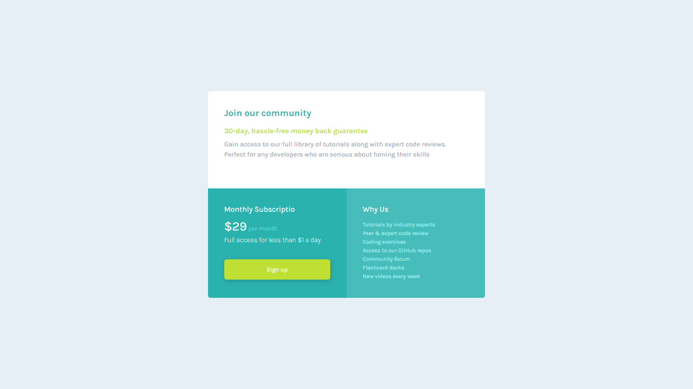

# Frontend Mentor - Single price grid component solution
## Table of contents

- [Visão Geral](#Visão-Geral)
  - [Desafio](#Desafio)
  - [Imagens da solução](#Imagens-da-solução)
  - [Links](#links)
  - [Tecnologias](#Tecnologias)
  - [Autores](#Autores)

## Visão Geral

### Desafio
- Criar uma grade de preço único similar aos designs fornecidos. 

### Imagens da solução

### Links

- Solution URL: [Add solution URL here](https://your-solution-url.com)
- Live Site URL: [Add live site URL here](https://your-live-site-url.com)

### Tecnologias

- Semantic HTML5 markup
- CSS custom properties
- CSS Grid

## Autores

- Linkedin - [Jéssica Leal](https://www.linkedin.com/in/j%C3%A9ssica-leal-65bab0124/)
- Instagram - [@jszylw](https://www.instagram.com/jszylw/)

- Linkedin - [Mateus Feliph](https://www.linkedin.com/in/mateus-feliph-2078951b3/)
- Instagram - [@Feliph_ventura](https://www.instagram.com/Feliph_ventura/)